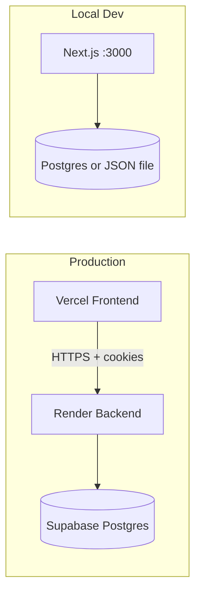
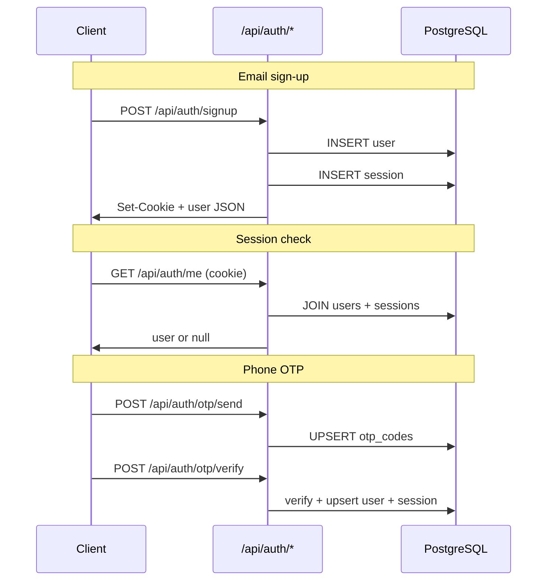
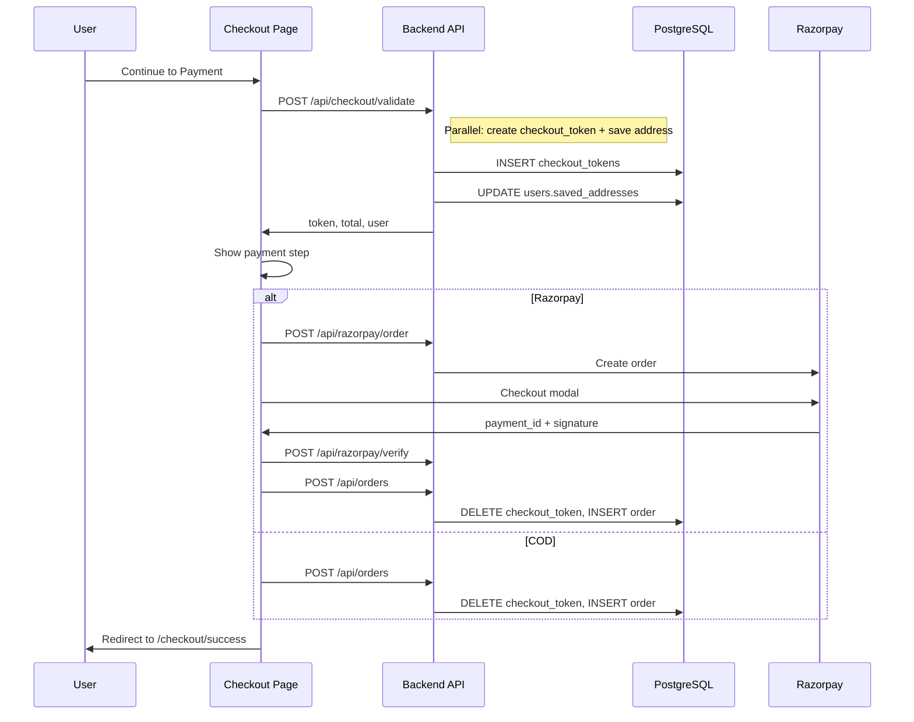

# MedLive Healthcare — Technical Documentation

This document explains how the MedLive Healthcare e-commerce application is built: architecture, database schema, API layer, authentication, checkout, payments, and frontend state.

---

## Table of Contents

1. [Overview](#overview)
2. [Tech Stack](#tech-stack)
3. [Deployment Architecture](#deployment-architecture)
4. [Project Structure](#project-structure)
5. [Database Schema](#database-schema)
6. [Data Layer](#data-layer)
7. [Authentication](#authentication)
8. [Products & Catalog](#products--catalog)
9. [Cart & Pricing](#cart--pricing)
10. [Checkout Flow](#checkout-flow)
11. [Payments (Razorpay)](#payments-razorpay)
12. [Orders & Returns](#orders--returns)
13. [API Reference](#api-reference)
14. [Frontend State](#frontend-state)
15. [Pincode & Logistics](#pincode--logistics)
16. [GST & Invoicing](#gst--invoicing)
17. [Chatbot](#chatbot)
18. [Environment Variables](#environment-variables)
19. [Local vs Production](#local-vs-production)
20. [Security Notes](#security-notes)

---

## Overview

MedLive Healthcare is a **Next.js 16** full-stack e-commerce site for medical consumables in India:

- Nitrile & latex examination gloves
- Adult diapers (Respect, Adult Choice)
- Disinfectant wipes

The app supports:

- Email/password and phone OTP sign-in
- Saved shipping addresses
- Promo codes
- GST invoicing (CGST/SGST/IGst split)
- Razorpay online payments and Cash on Delivery (COD)
- Order tracking, returns, and a rule-based support chatbot

**Production URLs (example):**

| Layer | Host | Role |
|-------|------|------|
| Frontend | `medlivehealthcare.vercel.app` | Static pages, React UI |
| Backend API | `medlivehealthcare.onrender.com` | Next.js API routes (`/api/*`) |
| Database | Supabase PostgreSQL | Persistent storage |

---

## Tech Stack

| Layer | Technology |
|-------|------------|
| Framework | Next.js 16 (App Router, Turbopack) |
| UI | React 19, Tailwind CSS 4, Lucide icons |
| Language | TypeScript 5 |
| Database | PostgreSQL via `postgres` npm package |
| Auth | `bcryptjs` (password hashing), `jose` (JWT sessions) |
| Payments | Razorpay Checkout |
| Fonts | Plus Jakarta Sans (Google Fonts) |

**Key dependencies** (`package.json`):

- `next` — framework and API routes
- `postgres` — direct SQL to Supabase pooler (no Supabase JS client)
- `bcryptjs` — password hashing (8 rounds)
- `jose` — HS256 JWT for session cookies
- `razorpay` — server-side order creation

---

## Deployment Architecture

The app can run in two modes:

### Split deployment (production)

```
Browser (Vercel)
    │
    │  fetch(NEXT_PUBLIC_API_URL + "/api/...")
    │  credentials: "include"  (cookies)
    ▼
Render (Next.js API)
    │
    │  DATABASE_URL
    ▼
Supabase PostgreSQL
```

- **Vercel** serves the frontend. `NEXT_PUBLIC_API_URL` points all API calls to Render.
- **Render** runs the same Next.js app but only the API routes are hit cross-origin.
- **CORS** is handled by `src/middleware.ts` on `/api/*` using `FRONTEND_URL`.
- Session cookies use `sameSite: "none"` + `secure: true` for cross-origin cookie sharing.

### Monolith (local development)

When `NEXT_PUBLIC_API_URL` is **empty**, `apiFetch("/api/...")` hits the same Next.js dev server (`localhost:3000`). No CORS needed; cookies use `sameSite: "lax"`.



---

## Project Structure

```
medlivehealthcare/
├── supabase/
│   └── schema.sql              # PostgreSQL DDL — run once in Supabase SQL Editor
├── public/
│   └── products/               # Product images (MedLive, Entealth brands)
├── src/
│   ├── app/                    # Next.js App Router pages + API routes
│   │   ├── api/                # Backend REST endpoints
│   │   ├── auth/               # Sign in, sign up, password reset pages
│   │   ├── checkout/           # Checkout + success pages
│   │   ├── products/           # Catalog + product detail
│   │   ├── account/            # User account + order detail
│   │   └── ...
│   ├── components/             # React UI components
│   ├── context/                # Auth, Cart, Chat providers
│   ├── lib/                    # Shared business logic
│   │   ├── server/             # Server-only: auth, store, checkout, db
│   │   ├── products.ts         # Static product catalog
│   │   ├── api.ts              # apiFetch / cross-origin URL helper
│   │   └── ...
│   └── middleware.ts           # CORS for split deployment
├── .env.example
└── TECHNICAL.md                # This file
```

---

## Database Schema

Schema lives in `supabase/schema.sql`. Run it once in the Supabase SQL Editor before first deploy.

### Entity Relationship

```mermaid
erDiagram
  users ||--o{ sessions : has
  users ||--o{ orders : places
  users ||--o{ checkout_tokens : owns
  users ||--o{ password_reset_tokens : requests
  users {
    text id PK
    text name
    text email UK
    text phone
    text password_hash
    boolean is_guest
    text gstin
    jsonb saved_addresses
    timestamptz created_at
  }
  sessions {
    text token PK
    text user_id FK
    timestamptz expires_at
  }
  orders {
    text id PK
    text order_number UK
    text user_id FK
    jsonb items
    numeric total
    jsonb shipping_address
    jsonb shipment
    jsonb return_request
  }
  checkout_tokens {
    text token PK
    text user_id FK
    jsonb items
    timestamptz expires_at
  }
```



### Table: `users`

| Column | Type | Description |
|--------|------|-------------|
| `id` | `text` PK | UUID string |
| `name` | `text` | Display name |
| `email` | `text` UNIQUE | Lowercased email; nullable for phone-only users |
| `phone` | `text` | 10-digit Indian mobile |
| `password_hash` | `text` | bcrypt hash; null for OTP-only users |
| `is_guest` | `boolean` | Legacy flag; false for registered users |
| `gstin` | `text` | Optional GST registration number |
| `saved_addresses` | `jsonb` | Array of `SavedAddress` objects |
| `created_at` | `timestamptz` | Account creation time |

### Table: `sessions`

Server-side session records paired with JWT cookies.

| Column | Type | Description |
|--------|------|-------------|
| `token` | `text` PK | Full JWT string (also stored in cookie) |
| `user_id` | `text` FK → `users.id` | Owner |
| `expires_at` | `timestamptz` | Session expiry (30 days) |

### Table: `orders`

| Column | Type | Description |
|--------|------|-------------|
| `id` | `text` PK | e.g. `ord_<uuid>` |
| `order_number` | `text` UNIQUE | e.g. `ML10001` |
| `user_id` | `text` FK | Null for guest checkout |
| `guest_phone`, `guest_email`, `guest_name` | `text` | Guest checkout fields |
| `items` | `jsonb` | Line items (product, qty, price, HSN) |
| `subtotal`, `promo_discount`, `shipping`, `tax`, `cgst`, `sgst`, `igst`, `total` | `numeric` | Pricing breakdown |
| `promo_code` | `text` | Applied promo |
| `payment_method` | `text` | `razorpay` or `cod` |
| `payment_status` | `text` | `pending`, `paid`, `failed`, `refunded` |
| `payment_id`, `razorpay_order_id` | `text` | Razorpay references |
| `status` | `text` | Order lifecycle status |
| `shipping_address` | `jsonb` | Full `SavedAddress` snapshot |
| `gstin` | `text` | Buyer GSTIN on invoice |
| `invoice_number` | `text` | e.g. `INV2610001` |
| `pincode` | `text` | Delivery PIN |
| `shipment` | `jsonb` | AWB, courier, tracking events |
| `return_request` | `jsonb` | Return/refund request if any |
| `created_at` | `timestamptz` | Order placed at |

**Indexes:** `orders_user_id_idx`, `orders_created_at_idx`

### Table: `checkout_tokens`

Short-lived server-side checkout sessions (30 minutes). Created at "Continue to Payment", consumed when order is placed.

| Column | Type | Description |
|--------|------|-------------|
| `token` | `text` PK | UUID |
| `user_id` | `text` FK | Optional logged-in user |
| `guest_phone` | `text` | Guest phone |
| `items` | `jsonb` | Validated cart lines + server prices |
| `subtotal` … `total` | `numeric` | Locked totals |
| `gstin` | `text` | GSTIN for invoice |
| `shipping_state` | `text` | Used for CGST/SGST vs IGST split |
| `expires_at` | `timestamptz` | 30 min TTL |

### Table: `otp_codes`

Phone OTP for passwordless sign-in (dev returns OTP in API response).

| Column | Type |
|--------|------|
| `phone` | `text` PK |
| `code` | `text` |
| `expires_at` | `timestamptz` (10 min) |

### Table: `password_reset_tokens`

| Column | Type |
|--------|------|
| `token` | `text` PK |
| `user_id` | `text` FK |
| `email` | `text` |
| `expires_at` | `timestamptz` (1 hour) |

### Table: `app_counters`

Single-row counter for atomic order/invoice number generation.

| Column | Type | Default |
|--------|------|---------|
| `id` | `int` PK | `1` (constraint: only row id=1) |
| `invoice_counter` | `int` | `1000` |
| `order_counter` | `int` | `10000` |

Order numbers: `ML{counter}` → `ML10001`  
Invoice numbers: `INV{FY}{counter padded}` → `INV2610001`

---

## Data Layer

Three layers sit between API routes and PostgreSQL:

```
API route
    → auth.ts / checkout.ts / store.ts
        → supabase-store.ts (targeted SQL OR full-store sync)
            → db.ts (postgres connection pool)
```

### `src/lib/server/db.ts`

- `isDatabaseConfigured()` — true when `DATABASE_URL` is set
- `getSql()` — singleton `postgres` client with SSL, pool size 10

### `src/lib/server/store.ts`

Defines TypeScript interfaces (`StoredUser`, `StoredOrder`, `CheckoutToken`, etc.) and:

- **`readStore()`** — loads entire DB into memory (or JSON file locally)
- **`mutateStore(fn)`** — read → mutate → write (queued writes)
- **`writeStore()`** — persists to Postgres or `data/medlive.json`

**Fallback:** Without `DATABASE_URL`, data is stored in `data/medlive.json` on disk (local dev only).

### `src/lib/server/supabase-store.ts`

Two modes of operation:

1. **Full-store sync** (legacy, still used for OTP):
   - `readStoreFromSupabase()` — SELECT all tables, purge expired rows
   - `persistStoreToSupabase()` — UPSERT users/orders, DELETE+INSERT sessions/tokens

2. **Targeted queries** (hot paths — auth, checkout, orders):
   - `dbFindUserByEmail`, `dbInsertSession`, `dbInsertCheckoutToken`
   - `dbConsumeCheckoutToken`, `dbInsertOrder`, `dbFindOrdersByUserId`
   - etc.

Targeted queries avoid loading every row on every request, which is critical for production latency on Render + Supabase.

---

## Authentication

### Session model

Hybrid **JWT + server-side session**:

1. On sign-in/sign-up, server creates a JWT (`jose`, HS256, 30-day expiry) with `sub: userId`
2. JWT is stored in httpOnly cookie `medlive_session`
3. Same JWT string is inserted into `sessions` table
4. On each request, `getSessionUser()`:
   - Verifies JWT signature and expiry
   - Confirms session row exists in DB (join `users` + `sessions`)

This allows server-side session revocation (password reset clears all user sessions).

### Cookie settings

| Environment | `sameSite` | `secure` |
|-------------|------------|----------|
| Local (monolith) | `lax` | production only |
| Split (Vercel→Render) | `none` | `true` |

### Auth flows



### Password reset

1. `POST /api/auth/forgot-password` — creates `password_reset_tokens` row, logs reset URL in dev
2. User opens `/auth/reset-password?token=...`
3. `POST /api/auth/reset-password` — validates token, updates `password_hash`, deletes token + all sessions

### Key files

| File | Role |
|------|------|
| `src/lib/server/auth.ts` | Core auth logic |
| `src/context/AuthContext.tsx` | Client auth state, `apiFetch` wrappers |
| `src/app/api/auth/*` | HTTP endpoints |

---

## Products & Catalog

Products are **static TypeScript data** in `src/lib/products.ts` — not stored in the database.

- ~20 SKUs across Gloves, Adult Diapers, Hygiene
- Images in `public/products/medlive/` and `public/products/entealth/`
- Image paths mapped in `src/lib/product-images.ts`
- Compliance metadata (HSN, GST rate) in `src/lib/product-compliance.ts`

Product detail page: `src/app/products/[id]/page.tsx`  
Catalog listing: `src/app/products/page.tsx`

### Variant keys

Some products support pack sizes via `variantKey`:

- Nitrile gloves: `pack-50`, `pack-100` with tiered bulk pricing
- Standard products: bulk tiers `tier10`, `tier20`

---

## Cart & Pricing

### Client-side cart (`CartContext`)

Stored in **localStorage** (not the database):

| Key | Content |
|-----|---------|
| `medlive_cart` | Cart line items |
| `medlive_promo` | Applied promo code |
| `medlive_pincode` | Delivery PIN code |

Each cart line has a `lineId` = `productId` or `productId:variantKey`.

### Server-side price validation

The client sends prices to checkout, but the **server recalculates and rejects mismatches**:

- `src/lib/cart-pricing.ts` — mirrors catalog + bulk tier logic
- `validateLineUnitPrice()` — tolerance ±₹0.02
- Prevents tampered client prices

### Promo codes (`src/lib/promo.ts`)

| Code | Rule |
|------|------|
| `MEDLIVE10` | 10% off, max ₹500 |
| `WELCOME50` | ₹50 off, min ₹299 |
| `HEALTH15` | 15% off, max ₹200 |

Validated client-side in cart; re-validated server-side at checkout.

### Order totals (`src/lib/orderTotals.ts`)

```
discountedSubtotal = subtotal - promoDiscount
shipping = 0  (free shipping everywhere in India)
tax = round(discountedSubtotal × 12%)
total = discountedSubtotal + shipping + tax
```

GST rate: `12%` (`src/lib/config.ts`)

---

## Checkout Flow

Two-step UI: **Shipping** → **Payment**



### Checkout token

- Created in `createCheckoutToken()` (`src/lib/server/checkout.ts`)
- TTL: **30 minutes**
- Locks: items, prices, promo, GST split, totals
- Consumed atomically via `DELETE ... RETURNING` when order is placed

### GST split

If shipping state is **Maharashtra**: tax splits 50/50 into CGST + SGST.  
All other states: full tax as IGST.

### Address saving

When "Save address to my account" is checked, address is saved in the **same** `/api/checkout/validate` request (parallel with token creation) — one network round trip instead of two.

---

## Payments (Razorpay)

### Flow

1. **`POST /api/razorpay/order`**
   - Reads amount from `checkoutToken` (server truth, not client amount)
   - Creates Razorpay order via official SDK
   - Returns `orderId`, `keyId` to client

2. **Client** opens Razorpay Checkout modal (`RazorpayPayment.tsx`)

3. **`POST /api/razorpay/verify`**
   - HMAC-SHA256 signature verification: `order_id|payment_id`
   - Uses `RAZORPAY_KEY_SECRET`

4. **`POST /api/orders`**
   - Creates order in DB with `paymentId` and `razorpayOrderId`

### COD

Skips Razorpay. `POST /api/orders` with `paymentMethod: "cod"`, `paymentStatus: "pending"`.

### Environment

| Variable | Where | Purpose |
|----------|-------|---------|
| `NEXT_PUBLIC_RAZORPAY_KEY_ID` | Client + server | Public key |
| `RAZORPAY_KEY_SECRET` | Server only | Signature verification |

---

## Orders & Returns

### Order creation (`createOrderFromCheckout`)

1. Validate PIN code serviceability
2. Consume checkout token
3. Atomically increment `app_counters` → order + invoice numbers
4. Generate mock shipment (`src/lib/logistics.ts`)
5. Insert order row

### Order statuses

`pending` → `paid` → `processing` → `shipped` → `out_for_delivery` → `delivered`  
Also: `cancelled`, `return_requested`, `refunded`

### Returns

`POST /api/orders/[id]` with `productIds`, `reason`, `comments`:

- Calculates pro-rata refund including GST
- Sets `return_request` JSON on order
- Updates `status` to `return_requested`

### Invoice

`GET /api/invoice/[orderId]` — returns HTML GST invoice (`src/lib/gst-invoice.ts`)

### Client adapter

`serverOrderToClient()` in `src/lib/server/order-adapter.ts` maps `StoredOrder` → client `Order` type, rehydrating product details from static catalog.

---

## API Reference

All routes live under `src/app/api/`. Client calls use `apiFetch()` which prefixes `NEXT_PUBLIC_API_URL` when set.

### Auth

| Method | Path | Description |
|--------|------|-------------|
| `POST` | `/api/auth/signup` | Register + session cookie |
| `POST` | `/api/auth/signin` | Login + session cookie |
| `GET` | `/api/auth/me` | Current user from cookie |
| `DELETE` | `/api/auth/me` | Sign out |
| `POST` | `/api/auth/address` | Save shipping address |
| `POST` | `/api/auth/forgot-password` | Request reset email |
| `GET` | `/api/auth/reset-password?token=` | Validate reset token |
| `POST` | `/api/auth/reset-password` | Set new password |
| `POST` | `/api/auth/otp/send` | Send phone OTP |
| `POST` | `/api/auth/otp/verify` | Verify OTP + sign in |

### Checkout & Orders

| Method | Path | Description |
|--------|------|-------------|
| `POST` | `/api/checkout/validate` | Create checkout token (+ optional address save) |
| `POST` | `/api/orders` | Place order from checkout token |
| `GET` | `/api/orders` | List orders for signed-in user |
| `GET` | `/api/orders/[id]` | Get single order |
| `POST` | `/api/orders/[id]` | Request return |
| `GET` | `/api/invoice/[orderId]` | HTML GST invoice |

### Payments

| Method | Path | Description |
|--------|------|-------------|
| `POST` | `/api/razorpay/order` | Create Razorpay order |
| `POST` | `/api/razorpay/verify` | Verify payment signature |

---

## Frontend State

### Provider tree (`src/context/Providers.tsx`)

```
AuthProvider
  └── CartProvider
        └── ChatProvider
```

### AuthContext

- Loads session on mount via `GET /api/auth/me`
- Clears legacy localStorage keys (`medlive_users`, `medlive_session`, `medlive_orders`)
- Exposes: `signUp`, `signIn`, `signInWithOtp`, `sendOtp`, `signOut`, `saveAddress`, `refreshUser`

### CartContext

- Cart, promo, pincode in localStorage
- Computes `totals` via `calculateOrderTotals`
- Pincode check via `checkPincode()` (client-side lookup tables)

### ChatContext + ChatWidget

- Rule-based FAQ bot (`src/lib/chatbot.ts`)
- Keyword matching — **no LLM / external API**
- Order-aware replies when opened from order detail page

### Key pages

| Route | File | Purpose |
|-------|------|---------|
| `/` | `src/app/page.tsx` | Home, hero, product sections |
| `/products` | `src/app/products/page.tsx` | Catalog |
| `/products/[id]` | `src/app/products/[id]/page.tsx` | PDP |
| `/cart` | `src/app/cart/page.tsx` | Cart |
| `/checkout` | `src/app/checkout/page.tsx` | 2-step checkout |
| `/account` | `src/app/account/page.tsx` | Profile + orders |
| `/auth/signin` | `src/app/auth/signin/page.tsx` | Login |

---

## Pincode & Logistics

### Serviceability (`src/lib/pincode.ts`)

Client and server use prefix-based lookup tables:

- 3-digit prefix → city + state (e.g. `400` → Mumbai)
- 2-digit prefix → state fallback
- All valid 6-digit PINs are serviceable
- ETA varies by region (metro / tier1 / other)

### Shipment generation (`src/lib/logistics.ts`)

On order placement, a **mock shipment** is created:

- Courier picked by PIN prefix (Delhivery, Blue Dart, DTDC)
- AWB generated from order number + PIN
- Tracking URL: `https://track.medlivehealthcare.in/{awb}`
- Initial events: label created, handed to courier

`advanceShipmentStatus()` simulates progression based on order age (used in order tracking UI).

---

## GST & Invoicing

- **GST rate:** 12% on discounted subtotal
- **Maharashtra orders:** CGST 6% + SGST 6%
- **Other states:** IGST 12%
- Buyer can enter **GSTIN** at checkout for B2B tax invoices
- Invoice HTML generated server-side with HSN codes per line item

---

## Chatbot

`src/lib/chatbot.ts` — deterministic keyword bot:

- Topics: tracking, returns, delivery, payments, support
- Uses order data when `ChatOpenContext.order` is passed
- Quick-reply chips change based on general vs order context
- No database writes; read-only assistance

---

## Environment Variables

See `.env.example` for the full list.

### Vercel (frontend)

```env
NEXT_PUBLIC_API_URL=https://medlivehealthcare.onrender.com
NEXT_PUBLIC_APP_URL=https://medlivehealthcare.vercel.app
NEXT_PUBLIC_RAZORPAY_KEY_ID=rzp_test_...
```

### Render (backend)

```env
DATABASE_URL=postgresql://...@...pooler.supabase.com:6543/postgres
AUTH_SECRET=<long-random-string>
RAZORPAY_KEY_SECRET=...
FRONTEND_URL=https://medlivehealthcare.vercel.app
NEXT_PUBLIC_APP_URL=https://medlivehealthcare.vercel.app
NEXT_PUBLIC_RAZORPAY_KEY_ID=rzp_test_...
```

### Local development

```env
# Leave NEXT_PUBLIC_API_URL empty for monolith mode
AUTH_SECRET=...
DATABASE_URL=postgresql://...
NEXT_PUBLIC_RAZORPAY_KEY_ID=rzp_test_...
RAZORPAY_KEY_SECRET=...
NEXT_PUBLIC_APP_URL=http://localhost:3000
```

---

## Local vs Production

| Aspect | Local | Production |
|--------|-------|------------|
| API host | Same origin (`:3000`) | Vercel → Render |
| Database | Supabase or `data/medlive.json` | Supabase only |
| Cookies | `sameSite: lax` | `sameSite: none` |
| CORS | Not needed | `middleware.ts` + `FRONTEND_URL` |
| OTP | Returned in API response (`demoOtp`) | Not returned (SMS not wired) |
| Password reset | Logged to console | Needs email provider |

---

## Security Notes

| Area | Implementation |
|------|----------------|
| Passwords | bcrypt, 8 rounds |
| Sessions | httpOnly JWT cookie + DB session row |
| CSRF | `sameSite` cookie policy |
| Price tampering | Server recalculates all line prices at checkout |
| Razorpay | HMAC signature verification before order creation |
| SQL | Parameterized queries via `postgres` tagged templates |
| Secrets | `AUTH_SECRET`, `RAZORPAY_KEY_SECRET`, `DATABASE_URL` server-only |

**Not yet implemented:**

- Rate limiting on auth/OTP endpoints
- Production email for password reset (currently console.log in dev)
- Production SMS for OTP
- Real courier API integration (shipments are simulated)

---

## Performance Optimizations

Recent changes (PR #10) replaced full-store read/write on hot paths:

| Operation | Before | After |
|-----------|--------|-------|
| Sign in | Load all tables × 2 | 1 user lookup + 1 session insert |
| Session check | Load all tables | 1 JOIN query |
| Checkout validate | Full store sync | 1 checkout token insert |
| Continue to Payment | 2 sequential API calls | 1 combined API call |
| Orders list | Full store read | `SELECT` by `user_id` |
| Place order | 2× full store sync | Token consume + order insert + counter bump |

---

## Running Locally

```bash
cp .env.example .env.local
# Fill in DATABASE_URL, AUTH_SECRET, Razorpay keys

npm install
npm run dev     # http://localhost:3000
npm run build   # production build
npm start       # production server
```

**Database setup:** Run `supabase/schema.sql` in Supabase SQL Editor before first use.

---

*Last updated: June 2026 — reflects codebase after PR #10 (targeted SQL + combined checkout validate).*
